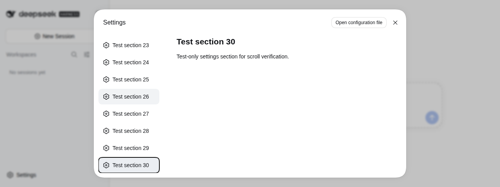
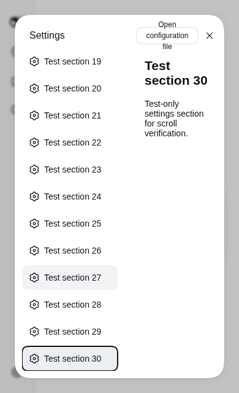

# Validation: v0.1.1

Validated on 2026-09-13 with DSH `0.1.5-rc.2`, the official Web settings shell, and headless Google Chrome on Linux.

## Real DSH checks

A separate temporary DSH home ran on an OS-assigned loopback port. The browser loaded the release-format plugin through the real DSH module loader. A test-only plugin registered 30 extra sections through the official `settings.section` slot, giving 34 navigation items. No personal account, workspace or conversation data was used.

- At 1280 × 480, native wheel input scrolled the navigation while the settings title and right content retained their positions.
- Home/End and Arrow Up/Down moved focus; Enter opened the final test section.
- Closing and reopening the settings dialog produced one scroll region and one plugin stylesheet.
- At 390 × 640, the final section stayed reachable and the navigation remained inside the viewport after the host responsive transition settled.
- No browser page errors occurred during these checks.

The narrow-viewport check covers navigation reachability, not a redesign of the host settings content or header. Hardware touch gestures, all community skins, and other DSH versions were not tested.

## Isolated lifecycle and package checks

- The same browser source was mounted and disposed in a minimal labelled-dialog fixture: owned styles and attributes were removed, and unrelated navigation was unchanged.
- `npm test` verified the built client registers the correct DSH module and hands its effect to Cordis.
- `npm run build` generated the host/client entries; `npm pack` produced the installable tarball.

## Design note

Use a bounded flex child with `min-height: 0`, native `overflow-y: auto`, and non-shrinking buttons. The title remains outside the scroll area. Hash-independent matching is restricted to the official labelled modal navigation with a `*_navList` class. A Cordis-owned effect handles dynamic dialog mounts and cleans up on unload. Focus reveal adjusts only the navigation's scroll position. No core files, persistent settings, or network services are changed by the plugin.

## v0.1.1 regression checks

The real DSH desktop, narrow viewport, keyboard and reopen checks passed again. A Chromium regression fixture also verified zero document settings scans across 30 conversation DOM mutations both with settings closed and open; dynamically added buttons, removal/reinsertion, and disposal with a pending frame passed. `npm test` runs this fixture and the package loader check.
